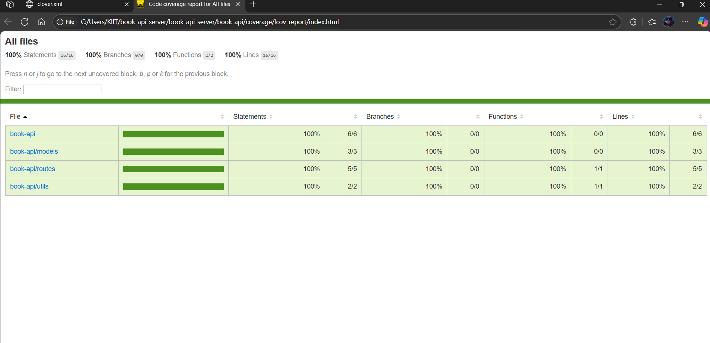
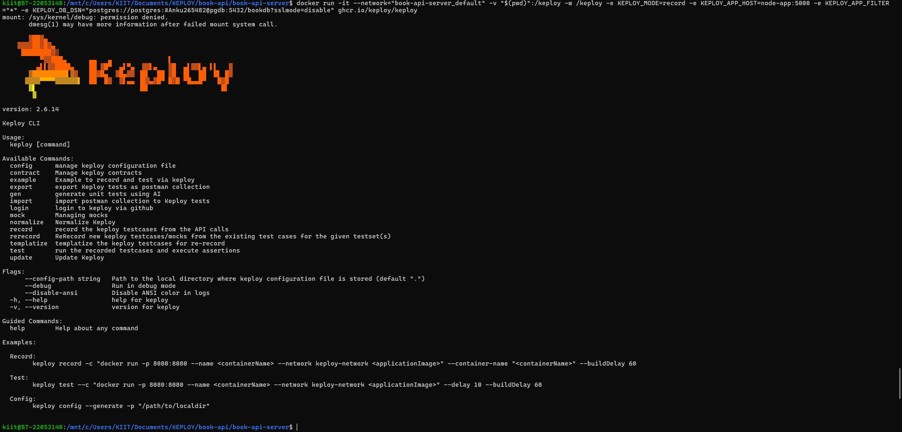
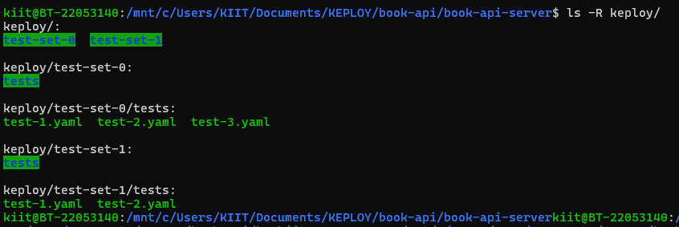
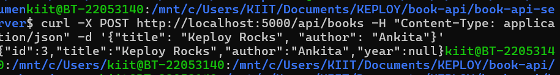

# 📚 Book API Server

This is a Node.js-based RESTful API server for managing books and users. The project is dockerized, connected with PostgreSQL, and includes unit, integration, API tests, and automated test generation using Keploy.

---

## 🔌 API Endpoints

### 👥 Users
- `GET /users` – Get all users  
- `POST /users` – Create a user  
- `PUT /users/:id` – Update a user  
- `DELETE /users/:id` – Delete a user

### 📚 Books
- `GET /api/books` – List all books  
- `POST /api/books` – Create a new book  
- `GET /api/books/:id` – Get book by ID  
- `DELETE /api/books/:id` – Delete book by ID  

> 📌 *You can extend routes for more resources.*

---

## 🧰 Tech Stack

| Layer         | Tech                            |
|---------------|---------------------------------|
| Language      | JavaScript (Node.js)            |
| Framework     | Express.js                      |
| Database      | PostgreSQL                      |
| DB Client     | node-postgres (`pg`)            |
| Testing       | Jest, Supertest                 |
| In-Memory DB  | `mongodb-memory-server` (tests) |
| Environment   | dotenv                          |

---

## 🚀 How to Run the App

```bash
git clone https://github.com/ankita-2311/book-api-server.git
cd book-api-server
docker compose up --build
## 📸 Screenshots

### ✅ Test Coverage Report


### 🐰 Keploy CLI Output


### ✅ Keploy Folder Test Files


### 🐰 curl POST Success


